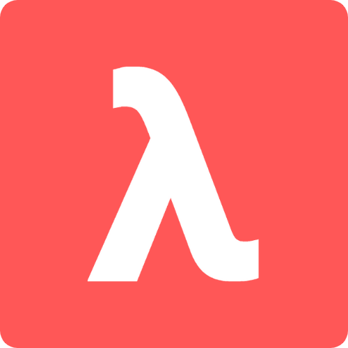

<p align="center">
  <a href="" rel="noopener">
  </a>
</p>

<h2 align="center"><b>Lambda language</b></h2>


<p align="center"> 
  A powerful and mathematics oriented programming language based on typed lambda calculus.
  <br /><br />
</p>

```py
main ← λ⟨⟩ →
  ⟨ ∀msg ∈ 𝕊, msg ⟩ ← "World"
    ⇒ print ("Hello " + msg)
```
